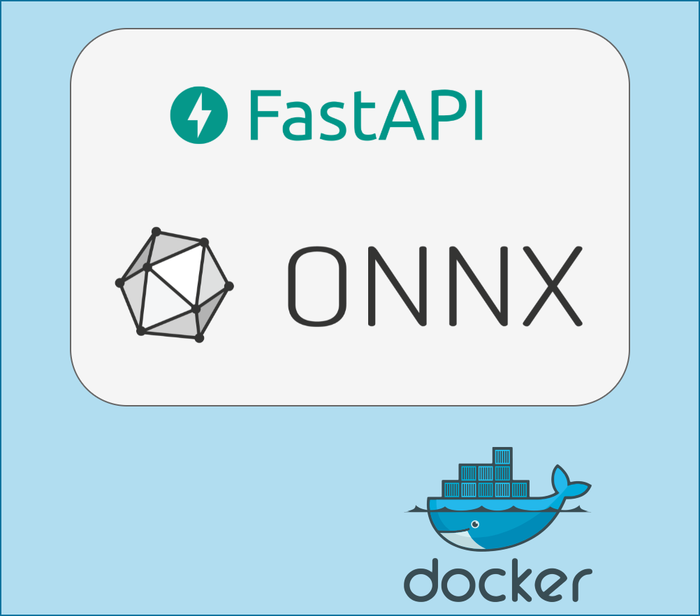
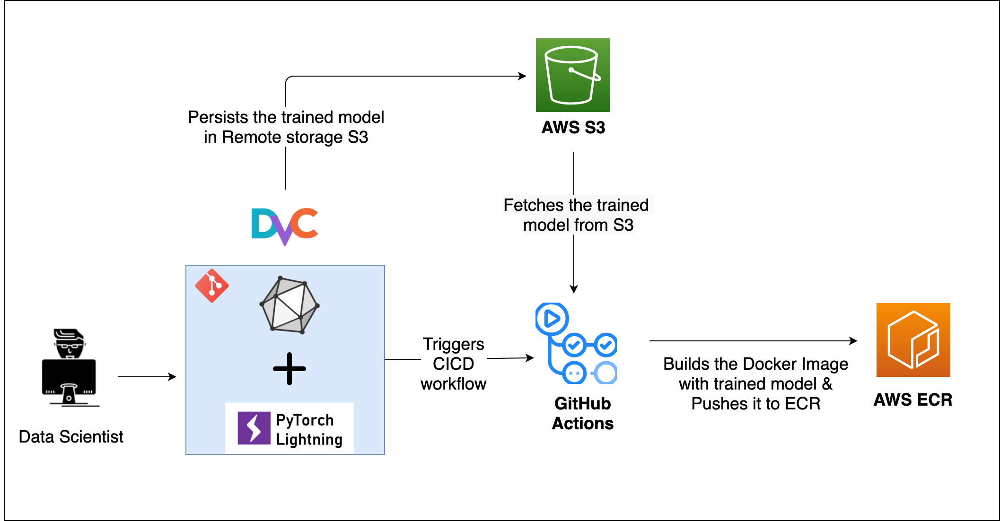

# Grammarly

<!-- ABOUT THE PROJECT -->
## ABOUT THE PROJECT
The goal of the project is to understand and build a End-To-End MLOps lifecycle from  model building, monitoring, configurations, testing, packaging, deployment to CI/CD, etc.

<!-- ***********************************************************************************************************************-->

## Part 1: Deep Learning Project

The project that've implemented is a simple deep learning model which predicts whether a given sentence is gramatically correct or not.
  - Input data : 'glue'
  - model : 'google/bert_uncased_L-2_H-128_A-2'
  - output format : 'Probabilities [correct, incorrect]'
  - framework : 'Pytorch-Lightning', 'Huggingface Datasets' , 'Huggingfacemodels'
  
Following tech stack is used:

- [Huggingface Datasets](https://github.com/huggingface/datasets)
- [Huggingface Transformers](https://github.com/huggingface/transformers)
- [Pytorch Lightning](https://pytorch-lightning.readthedocs.io/)

## Part 2: Model monitoring - Weights and Biases

Weight and Biases alone can be used to do many different Mlops tasks like model monitoring, hyperparameter tracking, model and data versioning etc.
But I've used only for tracking model training.

  - plotted model training
  - confusion matrix
  - a table displaying incorrectly classified datapoints
  

References:

- [Tutorial on Pytorch Lightning + Weights & Bias](https://www.youtube.com/watch?v=hUXQm46TAKc)
- [WandB Documentation](https://docs.wandb.ai/)
- [Weights and Biases](https://wandb.ai/site)
- [torchmetrics](https://torchmetrics.readthedocs.io/)

## Part 3: Configurations - Hydra

Configuration management is a necessary for managing complex software systems. Lack of configuration management can cause serious problems with reliability, uptime, and the ability to scale a system. Configuration management helps to scale our project with much hassle and have all the tuning requirements at hand.

  - configured model hyperparams

References

- [Hydra Documentation](https://hydra.cc/docs/intro)
- Kaggle notebooks/ Competitions solutions

## Part 4: Data Version Control - DVC

Versioning platforms like github can't be used to version large files like model and dataset. This is where DVC(data version control) comes into picture. With DVC we can easily keep track/ version our model and dataset, which itself can be stored at different location like AWS S3, or as simple as a google drive.

- [DVC Documentation](https://dvc.org/doc)

- [DVC Tutorial on Versioning data](https://www.youtube.com/watch?v=kLKBcPonMYw)

## Part 5: Model Packaging - ONNX

Why do we need model packaging? Models can be built using any machine learning framework available out there (sklearn, tensorflow, pytorch, etc.). We might want to deploy models in different environments like (mobile, web, raspberry pi) or want to run in a different framework (trained in pytorch, inference in tensorflow).
A common file format to enable AI developers to use models with a variety of frameworks, tools, runtimes, and compilers will help a lot.

This is acheived by a community project `ONNX`.

References

- [Abhishek Thakur tutorial on onnx model conversion](https://www.youtube.com/watch?v=7nutT3Aacyw)
- [Pytorch Lightning documentation on onnx conversion](https://pytorch-lightning.readthedocs.io/en/stable/common/production_inference.html)
- [Huggingface Blog on ONNXRuntime](https://medium.com/microsoftazure/accelerate-your-nlp-pipelines-using-hugging-face-transformers-and-onnx-runtime-2443578f4333)

## Prt 6: Model Packaging - Docker
  A lot of newbie engineers complain that the code doesnt run on their computer but it runs on code-owners computer. This can be because of dependency issue or OS related issues. That is why to share a project we can just package the project and easily share it with others without any dependency problems. Dockers comes in handy for every data scientists because a data science can require a lot of lib to be installed in order to run a project.

So for others to run the applications they have to set up the same environment as it was run on the host side which means a lot of manual configuration and installation of components.

The solution to these limitations is a technology called Containers.

By containerizing/packaging the application, we can run the application on any cloud platform to get advantages of managed services and autoscaling and reliability, and many more.

The most prominent tool to do the packaging of application is Docker 🛳

References

- [Analytics vidhya blog](https://www.analyticsvidhya.com/blog/2021/06/a-hands-on-guide-to-containerized-your-machine-learning-workflow-with-docker/)

## part 7: CI/CD - GitHub Actions

CI/CD is a method to frequently deliver apps to customers by introducing automation into the stages of app development.

Data Science is a itertive process where we have to keep updating our model and dataset. So whenever a new model is trained and if it performs better than previous version then it has to be replaced with better performing model. Github Actions helps us in automating many intermediate tasks which if done manually would eat up a lot of data scientists time. 

References

- [Configuring service account](https://dvc.org/doc/user-guide/setup-google-drive-remote)

- [Github actions](https://docs.github.com/en/actions/quickstart)

## Part 8: Container Registry - AWS ECR

A container registry is a place to store container images. A container image is a file comprised of multiple layers which can execute applications in a single instance. Hosting all the images in one stored location allows users to commit, identify and pull images when needed.

Amazon Simple Storage Service (S3) is a storage for the internet. It is designed for large-capacity, low-cost storage provision across multiple geographical regions.

## Part 9: Serverless Deployment - AWS Lambda

A serverless architecture is a way to build and run applications and services without having to manage infrastructure. The application still runs on servers, but all the server management is done by third party service (AWS). We no longer have to provision, scale, and maintain servers to run the applications. By using a serverless architecture, developers can focus on their core product instead of worrying about managing and operating servers or runtimes, either in the cloud or on-premises.

## Week 9: Prediction Monitoring - Kibana

Refer to the [Blog Post here](https://www.ravirajag.dev/blog/mlops-monitoring)

Monitoring systems can help give us confidence that our systems are running smoothly and, in the event of a system failure, can quickly provide appropriate context when diagnosing the root cause.

Things we want to monitor during and training and inference are different. During training we are concered about whether the loss is decreasing or not, whether the model is overfitting, etc.

But, during inference, We like to have confidence that our model is making correct predictions.

There are many reasons why a model can fail to make useful predictions:

- The underlying data distribution has shifted over time and the model has gone stale. i.e inference data characteristics is different from the data characteristics used to train the model.

- The inference data stream contains edge cases (not seen during model training). In this scenarios model might perform poorly or can lead to errors.

- The model was misconfigured in its production deployment. (Configuration issues are common)

In all of these scenarios, the model could still make a `successful` prediction from a service perspective, but the predictions will likely not be useful. Monitoring machine learning models can help us detect such scenarios and intervene (e.g. trigger a model retraining/deployment pipeline).

In this week, I will be going through the following topics:

- `Basics of Cloudwatch Logs`

- `Creating Elastic Search Cluster`

- `Configuring Cloudwatch Logs with Elastic Search`

- `Creating Index Patterns in Kibana`

- `Creating Kibana Visualisations`

- `Creating Kibana Dashboard`

